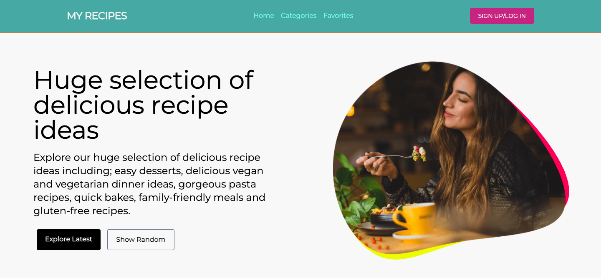

# Recipes web application - <a href="https://adoring-lovelace-5d27bb.netlify.app/">Demo</a>

## Description

Recipes website depend on Edamam API that show you all the categories and help you to 
search for any recipe and register to make your favorites list in addition to show many 
information about the recipe ex: (ingredients, Nutrients, calories, etc). 



## The SPA with 7 pages (routes):

1. Home page where you can search for a recipe and filter it. 
2. Categories page where you can see all availabe categories.
3. Category page which displays a list of recipe depend on selected category.
4. Favorites page where you can make your list of recipe after login.
5. Recipe page to display selected recipe details.
6. Randome Recipe
7. Latest Recipe


## Getting Start:

To get started you can simply clone the repo and after that you have to Login Edemma
API: <a href="https://developer.edamam.com/edamam-docs-recipe-api-v1">Edamam</a> and 
get your own APP_ID and APP_KEY and write it in .env file

last thing install the dependencies in the root folder : 
> npm install 

> npm start 


## Application

### Structure of src file
```
src
├── App.css
├── App.jsx
├── components
│   ├── Breadcrumb
│   │   └── Breadcrumb.jsx
│   ├── CategoriesList
│   │   ├── CategoriesList.jsx
│   │   └── ctegoriesList.js
│   ├── CategoryItem
│   │   └── CategoryItem.jsx
│   ├── FilteredRecipe
│   │   ├── FilteredRecipe.jsx
│   │   └── filter.js
│   ├── Footer
│   │   └── Footer.jsx
│   ├── Header
│   │   └── Header.jsx
│   ├── Loading
│   │   └── Loading.jsx
│   ├── Login
│   │   └── Login.jsx
│   ├── Nav
│   │   └── Nav.jsx
│   ├── RecipeDetails
│   │   ├── Line.jsx
│   │   ├── RecipeDescription.jsx
│   │   ├── RecipeDetails.jsx
│   │   ├── RecipeFavButton.jsx
│   │   ├── RecipeIngredients.jsx
│   │   ├── RecipeNutritionItem.jsx
│   │   └── RecipesNutrition.jsx
│   ├── RecipeItem
│   │   └── RecipeItem.jsx
│   ├── RecipeSearch
│   │   └── RecipeSearch.jsx
│   ├── RecipesList
│   │   └── RecipesList.jsx
│   ├── ShowAll
│   │   └── ShowAll.jsx
│   ├── SignUpLogInForm
│   │   ├── CloseFormButton.jsx
│   │   ├── EmailAndPasswordInput.jsx
│   │   ├── ForgetPassword.jsx
│   │   ├── LoginAndSignUpForm.jsx
│   │   ├── LoginSignupButton.jsx
│   │   └── LoginSignupHeader.jsx
│   └── ViewMoreButton
│       └── ViewMore.jsx
├── context
│   ├── AuthContext.js
│   └── FavoritesContext.js
├── firebase
│   └── firebase.js
├── hooks
│   └── useFetch.js
├── index.css
├── index.js
└── pages
    ├── CategoriesPage.jsx
    ├── CategoryPage.jsx
    ├── FavoritesPage.jsx
    ├── HomePage.jsx
    ├── LatestRecipes.jsx
    ├── RandomRecipes.jsx
    └── RecipeDetailsPage.jsx
```

### ES6 + Features

* Arrow Functions
* Block-Scoped Variables Let and Const
* async await with try/catch
* Modules export/import
* Destructuring Assignment


### Libraries/Frameworks

* firebase
* react-router-dom
* react-icons
* react-toastify
* tailwincss


## Further Amendments to be made ?

As a result of one week task i have completed the above mentioned task but in future i want to add some more features:

1. Ability to make your diet program depend on Nutrients
2. Make a database to store favorites list and user information 
3. Ability to publish your own recipe

## Note : 
1. The API allow you to make 10 requests per minute :face_with_spiral_eyes:.


Please feel free to send me your feedback . I would love to hear from you . 


